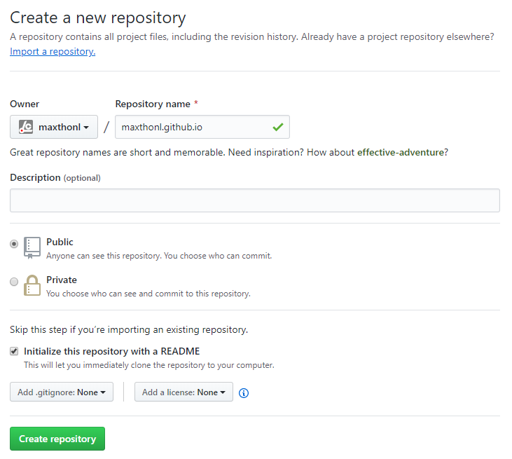
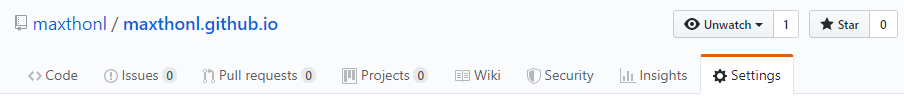
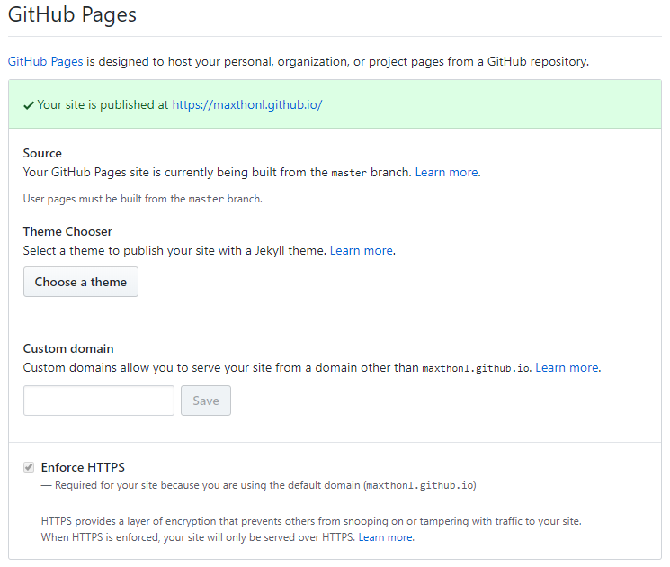
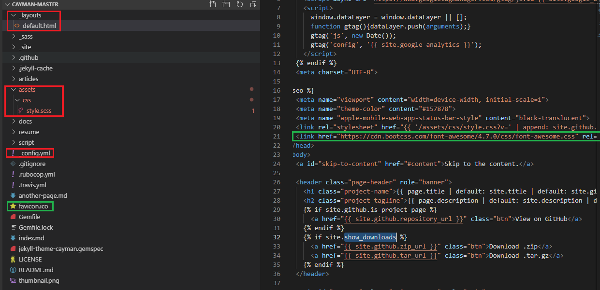
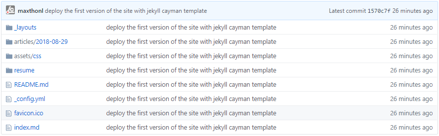

[[回到主页]](../../index.html)
## 开篇
> 本文将介绍如何利用GitHub提供的GitHub Pages功能免费构建自己的静态博客系统。

## 主页构建
> * 参考链接[GitHub Pages](https://pages.github.com)   
>
> 1. 创建一个名为 *username*.github.io 的 Public 仓库。这里建议新建一个名为index的md文件，默认情况下主页会跳转到index页面，如果没有会跳转到README页面。
> 
>
> 2. 进入 *username*.github.io 的 settings 页 找到 GitHub Pages 项。这个时候你会发现显示你的主页已经部署成功了，你可以点击链接访问过去了，虽然没有华丽的外表，但是它就在那等着你了，当你修改index的内容后，github会自动更新到你的主页上，有时候你需要等上1-2分钟。
> 
> 
>
> 3. 当然，你也可以选择 Custom Domain 来指向自己的域名而不是GitHub提供的，这个不在本篇讨论范围。我选择免费薅羊毛，毕竟人的精力有限，我不想打理太多东西。
>
> 4. 细心的同学应该已经看到GitHub Pages 设置项内有一个Theme Chooser功能，GitHub 允许选择的 Jekyll 模板范围有限，我选择的模板是 Cayman. 然后刷新下自己的主页。你会发现它变的丰富起来了，不要在意这个模板咋样，我看着是挺顺眼的。但是有些人觉得这模板不咋滴， 那么接下来我们就来看看如何修改这个模板吧。

## 模板构建
> 参考链接 [Jekyll Template](https://jekyllrb.com/)   
> 首先我们基于我选择的这个模板着手， Git 链接 [Cayman](https://github.com/pages-themes/cayman)   
> * 安装Ruby，我安装的版本是 2.6.3，已经安装的跳过   
> * 参照Cayman的README, 本地运行 Cayman，毕竟我们自己的主页先要在本地部署测试完成了再丢到GitHub上。我本地使用 VS Code 编辑器来修改的  
> 
> 1. git clone https://github.com/pages-themes/cayman
>
> 2. VS Code 打开Cayman的项目文件夹;
>
> 3. 修改Gemfile, 如果对国内的网络有信心可以忽略此步骤
> ```bash
> # source 'https://rubygems.org' 替换为下一行
> source 'https://gems.ruby-china.com'
> ```
>
> 4. 项目路径下执行bash脚本 script/bootstrap, 这个是用来帮助你安装所有依赖项的;
>
> 5. 项目路径下执行bash脚本 script/server, 这条命令会创建一个本地站点 [127.0.0.1:4000]。到这你就可以在本地来调试和修改自己想要的信息了。  
>
## 总结   
> 如果你不满意style，**改**；如果你不满意layout，**改**；如果你两个都满意，那就**改** _config.yml；所以这个模板存在的意义仅仅是占个坑而已，你想抹点儿泥上去，随你。例如:      
> _config.yml
> ```bash
> # 在配置文件内指定theme,无需使用Theme Chooser去指定theme
> title: Maxthon's Small World
> theme: jekyll-theme-cayman
> ```
> style.scss
> ```css
> @media print{
>    .site-footer-credits{ display: none;}
>    .noprint {display: none;}
>    .page-header {text-align: left}
> }
> ```
> 有点坑的是:
>   1. 记得所有的md文件最好都设置好title和description，不然会有意想不到的惊喜。
>   2. 部署后文件名是区分大小写的。   
>
>  * 项目结构如下   
> 可定制的文件用红色框框标注出来了。另外_site文件夹就是本地构建完成后的所有文件。这里我根据自己的需要加上了FontAwesome 和 favicon.icon。
>  
>
> * 修改完成后,我上传到 GitHub 中的文件如下:
> 
>

[[回到主页]](../../index.html)

[[下一篇 -- 初探 Dart 语言规范]](../2019-09-04/index.html)