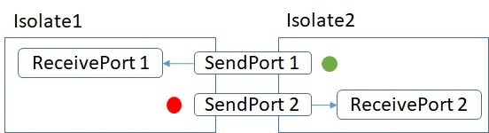

[[回到主页]](../../index.html)
## 开篇
> 一直在学Flutter，想着要过一下Dart Programming Language Specification，今天抽空花了一天时间简单的过了一下，摘了点好玩的出来，供大家参考。
原文链接：[Dart Programming Language Specification](https://dart.dev/guides/language/specifications/DartLangSpec-v2.2.pdf)，也就是ECMA-408。   
>我很反感一上来就这原理那架构的，基本功不扎实，架构就只是花架子了。进入正题吧：

## 1. noSuchMethod
> noSuchMethod, runtimeType 应该说目前ECMA-408关于函数的设计只有这两个，本文只看 *noSuchMethod*：
> ```dart
> void main() {
>     //注意，这里用dymaic是为了绕过编译时错误
>     dynamic foo =  Foo();
>     //1. 输出 Hi: maxthon
>     foo.sayHello(name: "maxthon");
> 
>     Function sayBye = foo.sayBye;
>     //2. 报错 因为Function sayBye 不属于 Foo，所以会调用Object.noSuchMethod
>     sayBye("maxthon");
> }
> 
> class Foo {
>   noSuchMethod(Invocation i) {
>     if (i.memberName ==  Symbol("sayHello")) {
>       print("Hi: " + i.namedArguments[Symbol("name")]);
>       //TODO: 这里我们可以适当的玩些好玩的东西，比如代理啊，日志啊
>       return null;
>     }else if (i.memberName ==  Symbol("sayBye")) {
>       print("Bye: " + i.namedArguments[Symbol("name")]);
>       //TODO：同上
>       return null;
>     }
>     return super.noSuchMethod(i);
>   }
> 
> }
> ```
> 原文：One special case to be aware of is where a forwarder is torn off and then invoked with an actual argument list which does not match the formal parameter list. In that situation we will get an invocation of Object.noSuchMethod rather than the noSuchMethod in the original receiver, because this is an invocation of a function object (and they do not override noSuchMethod)...

## 2. factory
> factory 用途很简单，允许构造函数内返回实例化对象，这包括缓存的，新建的，甚至是子类：   
> ```dart
> //Demo1： 假设我们维护了一个全局的DB Connection
> void main() {
>   var con1 = Connection("...");
>   //1. 打印...
>   print(con1.connectionString);
>   var con2 = Connection("***");
>   //2. 打印...
>   print(con2.connectionString);
> }
> 
> class Connection {
>   final String connectionString;
>   static Connection _connection;
> 
>   factory Connection(String connectionString) {
>       _connection ??= new Connection._internal(connectionString);
>       return _connection;
>   }
> 
>   Connection._internal(this.connectionString);
> }
> ```
> ```dart
> //Demo2: 假设我们维护了一组全局的DB Connection
> void main() {
>   var con1 = Connection("Oracle");
>   print(con1.connectionString);
>   var con2 = Connection("MySQL");
>   print(con2.connectionString);
> }
> 
> abstract class Connection {
>   final String connectionString;
>   static final Map<String, Connection> _connections = <String, Connection>{};
>   factory Connection(String type) {
>     switch (type) {
>       case "Oracle":
>         _connections.putIfAbsent(type, () => OracleConnection());
>         return _connections[type];
>       case "MySQL":
>         _connections.putIfAbsent(type, () => MySQLConnection());
>         return _connections[type];
>       default:
>         return MySQLConnection();
>     }
>   }
> 
>   Connection._internal(this.connectionString);
> }
> 
> class OracleConnection implements Connection {
>   final String connectionString = "...";
> }
> 
> class MySQLConnection implements Connection {
>   final String connectionString = "***";
> }
> ```
> 原文：A redirecting factory constructor specifies a call to a constructor of another class that is to be used whenever the redirecting constructor is called...

## 3. const constructor
> const 允许定义一个常量对象, 使用const修饰的constructor内部所有的成员变量都必须是final的. 并且传入的参数是编译时常量 (y = p+ 100). 这在防止对象被修改的场景中是非常有用的.
> ```dart
> class C {
>   final x, y, z;
>   const C(p, q): x = q, y = p + 100, z = p + q;
> }
> ```
> 原文：Nevertheless, the use of the formal parameters of a constant constructor within the constructor is of considerable utility. The concept of potentially constant expressions is introduced to facilitate limited use of such formal parameters. Specifically, we allow the usage of the formal parameters of a constant constructor for expressions that involve built-in operators, **but not for constant objects, lists and maps**...

## 4. template
> Dart的泛型还是比较随意的,<>包裹一下就好了；同时就因为这个问题我们必须保证在<T>的可见范围内，不允许有同名类，不然会有编译时错误，而且因为模板的局限性在某些情况下会出现编译错误：
> ```dart
> //Demo1:
> class T {}
> //编译错误: Attempt to subclass a type parameter
> class G<T> extends T {}
> ```
>
> ```dart
> //Demo2:
> void main() {
>   A b = B();
>   //编译时错误：编译时只能找到 A 的 X 方法
>   //int Function(int, int) fb = b.fi;
> 
>   //输出 2
>   int Function(int) fb = b.fi;
>   print(fb(1));
> 
>   //输出 2
>   Function fc = b.fi;
>   print(fc(1));
> }
> 
> class A {
>   X fi<X extends num>(X x,) => x;
> }
> class B extends A {
>   X fi<X extends num>(X x, [X y]) => x + (y??1);
> }
>```
> 原文：The type parameters of a generic class are available in the lexical scope of the superclass clause, potentially shadowing classes in the surrounding scope... 并参考 Generic Method Instantiation 章节

## 5. super class / mixin
> 首先声明dart是单继承，mixin就相当于一个有重载能力的程序片段，所以mixin不能声明构造函数，下面的示例显示Test的继承关系是从右到左的。
> ```dart
> void main() {
>   var tst = Test();
>   tst.init();
> }
> 
> mixin Mixin1 on BaseTest{
>   void init(){
>     print("Mixin1 init start");
>     //尝试注释掉 super.init();
>     super.init();
>     print("Mixin1 init end");
>   }
> }
> 
> mixin Mixin2 on BaseTest{
>   void init(){
>     print("Mixin2 init start");
>     super.init();
>     print("Mixin2 init end");
>   }
> }
> 
> class BaseTest{
>     void init(){
>       print("super init");
>     }
> 
>     BaseTest(){
>       print("BaseTest constructor");
>     }
> }
> 
> class Test extends BaseTest with Mixin2, Mixin1 {
>   @override
>   void init() {
>     print ("Test init start");
>     super.init();
>     print ("Test init end");
>   }
> }
> ```
> 打印的结果：
> ```bash
> >BaseTest constructor
> >Test init start
> >Mixin1 init start
> >Mixin2 init start
> >super init
> >Mixin2 init end
> >Mixin1 init end
> >Test init end
> ```
> 如果你尝试注释掉Mixin1的 super.init(); 你会发现打印结果变成了：
>```bash
> >BaseTest constructor
> >Test init start
> >Mixin1 init start
> >Mixin1 init end
> >Test init end
>```
> 这说明了mixin的super在运行时才能确定，如果我没有理解错的话。   
> 原文：The superclass S0 of a class C whose declaration has a with clause with M1, . . . , Mk and an extends clause extends S is the abstract class obtained by application of mixin composition (12) Mk, ..., M1 to S. The name S0 is a fresh identifier. If no with clause is specified then the extends clause of a class C specifies its superclass. If no extends clause is specified...

## 6. +
> Dart支持字符串相加但是不支持 string + number 的形式出现
> ```dart
> //编译错误：dart 认为这对编程人员不友好，所以使用了模板占位符来解决这个问题
> //同时还新增了一个长字符串换行的能力
> print("A simple sum: 2 + 2 = " + 2 + 2);
> print("A simple sum: 2 + 2 = ${2+2}");
> print("A very very long"
>        "string ");
> ```
> 原文：Dart also supports the operator + for string concatenation. The + operator on Strings requires a String argument. It does not coerce its argument into a string. This helps avoid puzzlers...

## 7. Symbol
> Symbol作为 dart 的反射特性可以在运行时动态获取 library, declaration 等信息，同时也是一个天然的enum。
> ```dart
> library maxthonlib;
> import "dart:core";
> import "dart:mirrors";
> 
> void main() {
>   var mirrorSystem = currentMirrorSystem();
>   var len = mirrorSystem.libraries.length;
>   for(var i=0; i<len; i++){
>     var lib = mirrorSystem.libraries[i];
>     if (lib?.declarations?.containsKey(Symbol("C")) != null) {
>       //1. 无法通过遍历的形式获取class C
>       print("Find C");
>     }
>   }
> 
>   var lib = mirrorSystem.findLibrary(Symbol("maxthonlib"));
>   //2. 输出 true，因为我们在 maxthonlib 下定义了一个名为 C 的类
>   print(lib.declarations.containsKey(Symbol("C")));
>   //3. 输出 true
>   print(Symbol("High") == Symbol("High"));
> }
> 
> class C {
> }
> ```
> 原文：A symbol literal denotes a name that would be either a valid declaration name or a valid library name in a Dart program The fact that symbols are easy to type and can often act as convenient substitutes for enums are secondary benefits...

## 8. cascaded
> Dart 的级联表达式 .. 赋予了编程人员更好的调用能力。让链式调用更优雅。..使得我们不需要在链式调用的某一个中间方法内返回原对象。
> ```dart
> void main() {
>   var c = C();
>   c
>     ..initA("hello")
>     ..initB("world")
>     ..toString();
> }
> 
> class C {
>   String _a, _b;
>   void initA(String a) { _a = a; }
>   void initB(String b) { _b = b; }
> 
>   @override
>   String toString() { 
>     print(_a + _b);
>     return _a + _b; 
>   }
> }
> ```
> 原文：A cascaded method invocation expression of the form e..suffix is equivalent to the expression (t)ft.suffix; return t;g(e).

## 9. single thread
> Dart是单线程的和JS类似，但是提供了并发的能力。两个 isolate 之间通过 message 实现通信。    
> 所有的Dart程序都会贮存在一个 isolate 内，每个 isolate 都可以定义一个或多个 ReceivePort，而每一个 ReceivePort 都通过暴露自身的 sendPort 给别的 isolate 向自身发送消息, 之后就进入了自身的event loop：
>
> 
> ```dart
> import "dart:async";
> import "dart:isolate";
> 
> // isolate1
> main() async {
>   var receivePort = new ReceivePort();
> 
>   //1. 告诉 isolate2 自己的 sendPort
>   await Isolate.spawn(entryPointFunc, receivePort.sendPort);
> 
>   //4. 获取 isolate2 的 sendPort
>   var sendPort = await receivePort.first;
> 
>   //5. 通过 isolate2 的 sendPort 发送消息给 isolate2
>   var msg = await sendReceive(sendPort, "start");
>   print("received $msg");
> 
>   msg = await sendReceive(sendPort, "end");
>   print("received $msg");
>   receivePort.close();
> }
> 
> Future sendReceive(SendPort port, String msg) {
>   ReceivePort response = new ReceivePort();
>   port.send([msg, response.sendPort]);
>   return response.first;
> }
> 
> // isolate2
> entryPointFunc(SendPort sendPort) async {
>   var receivePort = new ReceivePort();
> 
>   //2. 通过 isolate1 的 sendPort 将自己的 sendPort 告诉 isolate1
>   sendPort.send(receivePort.sendPort);
> 
>   //3. 并监听自己的 receivePort 的消息流
>   await for (var msg in receivePort) {
>     var data = msg[0];
>     SendPort replyTo = msg[1];
>     replyTo.send(data);
>     if (data == "end") {
>       receivePort.close();
>     }
>   }
> }
> ```
> 原文：Dart code is always single threaded. There is no shared-state concurrency in Dart. Concurrency is supported via actor-like entities called isolates. An isolate is a unit of concurrency. It has its own memory and its own thread of control. Isolates communicate by message passing (16.21.4). No state is ever shared between isolates. Isolates are created by spawning (16.16).

## 10. event loop
> Dart 语言规范虽然没有关于 event loop 的说明，但是在 library dart.isolate 内有关于 event loop的说明。简单来说就是每个isolate都会在自己的event loop内运行自己的代码，而且每一个event都会有更小的tasks运行在 microtask queue内，对 JS 的event loop了解的人，将毫不费力的理解这个原理，所以同理：**不要指望 Future.delayed 是合乎你的想象的**   
> 原文：Isolates run code in its own event loop, and each event may run smaller tasks in a nested microtask queue.

[[回到主页]](../../index.html) &nbsp;&nbsp; 

[[上一篇 -- 如何利用 GitHub Pages 构建自己的静态博客系统]](../2019-08-29/index.html) 

<!--[[下一篇]]()-->